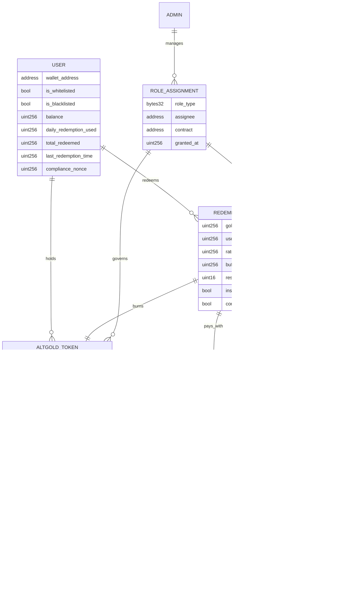

## ALT GOLD

<div align="center">

<strong>Gold-backed ALTGOLD token and instant Redemption on Ethereum Sepolia</strong>

[](https://opensource.org/licenses/MIT)
[](https://soliditylang.org/)
[](https://hardhat.org/)
[](https://www.openzeppelin.com/)
[](https://sepolia.etherscan.io/)

<br/>

<a href="https://sepolia.etherscan.io/address/0x4E9FB9BFAC54E66df63D342D5d6C7aa3AC2D1A77#code"><b>ALTGOLDToken (Proxy) on Etherscan</b></a>
·
<a href="https://sepolia.etherscan.io/address/0xb71e62699B930aD83ba22798678ad542256c1e57#code"><b>ALTGOLDRedemption on Etherscan</b></a>
·

·
<a href="https://docs.google.com/document/d/1HowUSKs8Ap7a5gRVd9J2bkAS1l69jcD-LspAMqxyoQM/edit?usp=sharing"><b>Technical Documentation (PDF)</b></a>

<br/>

[🚀 Quick Start](#prerequisites) • [🧪 Tests](#run-tests-on-sepolia) • [🛠️ Ops](#unified-ops-script) • [📊 Gas Reports](#gas-reports) • [🔐 Security](#security-considerations-and-trade-offs)

</div>

## ALT GOLD – Contracts, Deployment, Testing, and Ops

This repository contains the ALTGOLD token (`ALTGOLDToken`) and the Redemption contract (`ALTGOLDRedemption`), with end-to-end scripts for deployment, configuration, testing, and gas reporting on Sepolia and locally.

### Prerequisites
- Node.js 18+ (Hardhat warns on 18; 22 LTS recommended)
- Install dependencies:
  - `npm install`
- Configure `.env` with at least:
  - `SEPOLIA_URL`
  - `ETHERSCAN_API_KEY`
  - `PRIVATE_KEY`, `PRIVATE_KEY_1`, `PRIVATE_KEY_2`, `PRIVATE_KEY_3`
  - `ALTGOLD_TOKEN_ADDRESS` (UUPS proxy on Sepolia)
  - `REDEMPTION_ADDRESS` (on Sepolia)
  - `MOCK_USDC_ADDRESS` (USDC-6 on Sepolia)

### Install & Build
```
npm ci
npx hardhat compile
```

## Deployment Details (Sepolia)

- **Network**: Sepolia (chainId 11155111)
- **ALTGOLDToken (UUPS Proxy)**
  - Proxy Address: `0x49Ec351eBc1c8AdaE96cd8Be31B4e3fEF1cDE731`
  - Etherscan: `https://sepolia.etherscan.io/address/0x49Ec351eBc1c8AdaE96cd8Be31B4e3fEF1cDE731#code`
- **ALTGOLDRedemption**
  - Address: `0x88b2DF0C0fFd9eE80e2e230dEA71e324Ac4f9049`
  - Etherscan: `https://sepolia.etherscan.io/address/0x88b2DF0C0fFd9eE80e2e230dEA71e324Ac4f9049#code`
- **USDC (Mock/Test)**
  - Address: `0xFD6aB5BF624E879C9E78A5bc78BF205CaB866AC6`
  - Note: 6 decimals; used for redemption funding.

### ABIs
Built artifacts (ABIs) are available after `npx hardhat compile`:
- `artifacts/contracts/ALTGOLDToken.sol/ALTGOLDToken.json`
- `artifacts/contracts/redemption.sol/ALTGOLDRedemption.json`
- `artifacts/contracts/TestUSDC.sol/TestUSDC.json` (local mock for gas runs)

You can import these JSON files in dApps or scripts to interact with the deployed contracts.

## System Architecture

### System Overview



### Role Hierarchy

```
┌─────────────────────────────────────────────────┐
│              DEFAULT_ADMIN_ROLE                  │
│         (Multisig - Ultimate Control)            │
└─────────────────┬───────────────────────────────┘
                  │
    ┌─────────────┴─────────────────────────┐
    │                                       │
┌───▼────────────┐              ┌──────────▼──────────┐
│  ALTGOLD Token │              │ Redemption Contract │
│     Roles      │              │      Roles          │
└───┬────────────┘              └──────────┬──────────┘
    │                                      │
    ├─► SUPPLY_CONTROLLER_ROLE             ├─► TREASURER_ROLE
    ├─► WHITELIST_MANAGER_ROLE             ├─► COMPLIANCE_ROLE
    ├─► PAUSER_ROLE                        ├─► RATE_MANAGER_ROLE
    ├─► COMPLIANCE_OFFICER_ROLE            ├─► PAUSER_ROLE
    ├─► AUDITOR_ROLE                       └─► EMERGENCY_ROLE
    ├─► RESERVE_MANAGER_ROLE
    ├─► EXECUTOR_ROLE
    └─► BURNER_ROLE
```

### User Interaction Flow

#### 1) Token Acquisition Flow
```
User → [Must be Whitelisted] → ALTGOLD Token Contract
                                      │
                                      ▼
                            [Receive via Transfer]
                                  OR
                            [Admin Mints to User]
```

#### 2) Redemption Flow
```
User Journey:
─────────────
1. User holds ALTGOLD tokens
           │
           ▼
2. Approves Redemption Contract to spend ALTGOLD
           │
           ▼
3. Calls redeem() or redeemWithApproval()
           │
           ▼
4. Contract Checks:
   - User whitelisted? ✓
   - Not blacklisted? ✓
   - Within limits? ✓
   - Cooldown passed? ✓
   - Oracle price fresh? ✓
   - USDC reserve sufficient? ✓
           │
           ▼
5. Atomic Settlement:
   a. Pull ALTGOLD from user
   b. Burn ALTGOLD tokens
   c. Transfer USDC to user
           │
           ▼
6. Redemption Complete
```

### Contract Function Map

#### ALTGOLD Token Core Functions

**Public/External Functions:**
```
──────────────────────────
Users:
  • transfer(to, amount)
  • approve(spender, amount)
  • transferFrom(from, to, amount)
```

**Admin Functions by Role:**

```
SUPPLY_CONTROLLER:
  • mint(to, amount, reason)
  • burn(from, amount, reason)

WHITELIST_MANAGER:
  • addToWhitelist(account, kycRef)
  • removeFromWhitelist(account)
  • batchUpdateWhitelist(accounts[], statuses[], kycRefs[])

AUDITOR:
  • updateGoldReserve(totalGrams, tokenPerGram, auditRef)

RESERVE_MANAGER:
  • updateMintingLimits(perTx, daily, weekly, threshold, cooldown, maxDaily)

EXECUTOR:
  • executeMintRequest(requestId)

PAUSER:
  • pause(reason)
  • unpause(reason)

COMPLIANCE_OFFICER:
  • updateComplianceSettings(mode, maxTransfer, minHolding)

DEFAULT_ADMIN:
  • cancelMintRequest(requestId, reason)
  • resetCircuitBreaker()
  • setAuthorizedBurner(address, status)
```

#### Redemption Contract Core Functions

**Public/External Functions:**
```
──────────────────────────
Users:
  • redeem(amountALT)
  • redeemWithApproval(amountALT, expiry, signature)
  • depositUSDC(amount)

Oracle Updates (Permissionless):
  • updateUsdcPerGramFromOracle()
  • previewOracleUsdcPerGram() [view]
```

**Admin Functions by Role:**

```
RATE_MANAGER:
  • setGoldWeightPerALT(weight_g6)
  • setRateValidityPeriod(seconds)

TREASURER:
  • withdrawUSDC(to, amount)
  • setBuffer(amount)

COMPLIANCE:
  • updateBlacklist(user, status)

EMERGENCY:
  • scheduleEmergencyWithdrawal(recipient, amount)
  • executeEmergencyWithdrawal()

PAUSER:
  • pause()
  • unpause()

DEFAULT_ADMIN:
  • setOracleFeeds(xauFeed, usdcFeed)
  • setOracleConfig(staleness, deviation, min, max)
  • updateLimits(min, max, globalDaily, userDaily, cooldown)
  • setRedemptionSettings(instantEnabled, complianceRequired)
  • setProcessingWindow(enabled, startHour, endHour)
  • setReserveRequirementBps(bps)
  • cancelEmergencyWithdrawal()
```
### Process Flow Diagram

## Complete Flow Diagram

```mermaid
flowchart TD
    Start([👤 Customer Wants Gold-Backed Tokens])
    
    %% ===== PHASE 1: OFF-CHAIN ONBOARDING =====
    subgraph Phase1[" "]
        direction TB
        A1[Customer Inquiry]
        A2[Submit KYC/AML Documents]
        A3{KYC Approved?}
        A4[❌ Application Rejected]
        A5[✅ Customer Verified<br/>KYC Reference ID Generated]
        
        A1 --> A2
        A2 --> A3
        A3 -->|No| A4
        A3 -->|Yes| A5
    end
    
    %% ===== PHASE 2: PAYMENT & GOLD ACQUISITION =====
    subgraph Phase2[" "]
        direction TB
        B1[💰 Customer Pays Fiat Currency<br/>Bank Transfer/Wire]
        B2[🏢 Company Receives Payment]
        B3{Gold Acquisition}
        B4[🥇 Purchase Physical Gold<br/>from Market]
        B5[🏦 Allocate from<br/>Existing Vault]
        B6[🔒 Gold Stored in<br/>Secure Vault]
        
        B1 --> B2
        B2 --> B3
        B3 -->|New Purchase| B4
        B3 -->|Existing Inventory| B5
        B4 --> B6
        B5 --> B6
    end
    
    %% ===== PHASE 3: AUDIT & VERIFICATION =====
    subgraph Phase3[" "]
        direction TB
        C1[🔍 Independent Auditor<br/>Physical Verification]
        C2[📋 Audit Report Created<br/>IPFS Hash/Reference]
        C3[🎯 AUDITOR Role<br/>On-Chain Action]
        C4["updateGoldReserve(<br/>totalGrams,<br/>tokenPerGram,<br/>auditReference)"]
        C5[✅ Gold Reserves<br/>Updated On-Chain]
        C6[📊 Max Mintable<br/>Calculated]
        
        C1 --> C2
        C2 --> C3
        C3 --> C4
        C4 --> C5
        C5 --> C6
    end
    
    %% ===== PHASE 4: WHITELIST APPROVAL =====
    subgraph Phase4[" "]
        direction TB
        D1[👥 WHITELIST_MANAGER Role]
        D2["addToWhitelist(<br/>customerAddress,<br/>kycReferenceId)"]
        D3[✅ Customer Wallet<br/>Whitelisted]
        D4[🔓 Can Receive & Transfer<br/>ALTGOLD Tokens]
        
        D1 --> D2
        D2 --> D3
        D3 --> D4
    end
    
    %% ===== PHASE 5: TOKEN MINTING =====
    subgraph Phase5[" "]
        direction TB
        E1[🏭 SUPPLY_CONTROLLER Role]
        E2["mint(<br/>customerAddress,<br/>amount,<br/>reason)"]
        E3{Amount Check}
        E4[📦 Small Order<br/>< 50,000 ALTGOLD]
        E5[📦 Large Order<br/>≥ 50,000 ALTGOLD]
        E6[⚡ Immediate Mint<br/>_executeMint]
        E7[⏰ Create Timelock Request<br/>_createMintRequest]
        E8[⏳ Wait 24 Hours]
        E9[✅ EXECUTOR Role]
        E10["executeMintRequest(<br/>requestId)"]
        E11[🔍 Final Validation:<br/>- Whitelist still valid?<br/>- Gold backing sufficient?<br/>- Not cancelled?]
        E12[✅ Tokens Minted]
        
        E1 --> E2
        E2 --> E3
        E3 -->|Small| E4
        E3 -->|Large| E5
        E4 --> E6
        E5 --> E7
        E6 --> E12
        E7 --> E8
        E8 --> E9
        E9 --> E10
        E10 --> E11
        E11 --> E12
    end
    
    %% ===== PHASE 6: CUSTOMER HOLDS TOKENS =====
    subgraph Phase6[" "]
        direction TB
        F1[🎉 Customer Receives<br/>ALTGOLD Tokens]
        F2{What to Do?}
        F3[💼 Hold Tokens<br/>Store of Value]
        F4[🔄 Transfer to Others<br/>Only Whitelisted]
        F5[💱 Redeem for USDC<br/>Via Redemption Contract]
        
        F1 --> F2
        F2 --> F3
        F2 --> F4
        F2 --> F5
    end
    
    %% ===== PHASE 7: REDEMPTION PREPARATION =====
    subgraph Phase7[" "]
        direction TB
        G1[📊 Oracle Price Update<br/>Anyone Can Call]
        G2["updateUsdcPerGramFromOracle()"]
        G3[🔗 Chainlink Oracles:<br/>XAU/USD + USDC/USD]
        G4[🧮 Calculate:<br/>XAU/oz → USD/gram → USDC/gram]
        G5[💾 Cache Price On-Chain:<br/>usdcPerGram]
        G6[⏰ Set rateUpdatedAt]
        G7[✅ Redemption Rate Ready]
        
        G1 --> G2
        G2 --> G3
        G3 --> G4
        G4 --> G5
        G5 --> G6
        G6 --> G7
    end
    
    %% ===== PHASE 8: REDEMPTION EXECUTION =====
    subgraph Phase8[" "]
        direction TB
        H1[💱 Customer Initiates<br/>Redemption]
        H2{Redemption Type}
        H3["redeem(<br/>amountALT)"]
        H4["redeemWithApproval(<br/>amountALT, expiry, signature)"]
        H5[🔐 Compliance Signature<br/>Verification]
        H6[✅ Pre-Redemption Checks]
        H7["- Instant redemption enabled?<br/>- Amount within min/max?<br/>- User not blacklisted?<br/>- Price cache fresh?<br/>- Within processing window?<br/>- User whitelisted?<br/>- Cooldown passed?"]
        H8[🧮 Calculate USDC Amount:<br/>amountALT × goldWeightPerALT × usdcPerGram]
        H9[📊 Daily Limit Checks:<br/>- Global daily limit<br/>- User daily limit]
        H10[🔥 Burn ALTGOLD<br/>from User Wallet]
        H11[💸 Transfer USDC<br/>to User Wallet]
        H12[📝 Record Statistics:<br/>- Total redeemed<br/>- User history<br/>- Daily usage]
        H13[🎉 Redemption Complete]
        
        H1 --> H2
        H2 -->|Standard| H3
        H2 -->|With Compliance| H4
        H3 --> H6
        H4 --> H5
        H5 --> H6
        H6 --> H7
        H7 --> H8
        H8 --> H9
        H9 --> H10
        H10 --> H11
        H11 --> H12
        H12 --> H13
    end
    
    %% ===== PHASE 9: POST-REDEMPTION =====
    subgraph Phase9[" "]
        direction TB
        I1[💰 Customer Has USDC]
        I2{Next Action}
        I3[🏦 Withdraw to Bank<br/>Off-Chain Exchange]
        I4[💱 Trade on DEX/CEX]
        I5[🔄 Buy More ALTGOLD]
        
        I1 --> I2
        I2 --> I3
        I2 --> I4
        I2 --> I5
    end
    
    %% ===== FLOW CONNECTIONS =====
    Start --> Phase1
    Phase1 --> |Approved| Phase2
    Phase2 --> Phase3
    Phase3 --> Phase4
    Phase4 --> Phase5
    Phase5 --> Phase6
    Phase6 --> |Choose to Redeem| Phase7
    Phase7 --> Phase8
    Phase8 --> Phase9
    Phase9 --> |Cycle Repeats| Start
    
    %% ===== STYLING =====
    classDef offChain fill:#FFE5B4,stroke:#FF8C00,stroke-width:2px
    classDef onChain fill:#B4D7FF,stroke:#0066CC,stroke-width:2px
    classDef oracle fill:#D4EDDA,stroke:#28A745,stroke-width:2px
    classDef security fill:#F8D7DA,stroke:#DC3545,stroke-width:2px
    classDef success fill:#D1ECF1,stroke:#0C5460,stroke-width:2px
    
    class A1,A2,A5,B1,B2,B4,B5,B6,C1,C2,I3 offChain
    class C3,C4,C5,C6,D1,D2,D3,D4,E1,E2,E6,E7,E9,E10,E12,F1,H10,H11,H12 onChain
    class G1,G2,G3,G4,G5,G6,G7 oracle
    class H6,H7,H9,E11 security
    class F1,H13,I1 success
```



### Data Flow Diagram

#### Minting Process
```
Gold Audit → Auditor Updates Reserve → Calculate Max Mintable
                                              │
                                              ▼
Supply Controller → Mint Request → Under Threshold? 
                                    │            │
                                    Yes          No
                                    │            │
                                    ▼            ▼
                              Immediate    24hr Timelock
                                Mint         Required
                                    │            │
                                    └────────────┘
                                          │
                                          ▼
                                    Tokens Created
```

#### Redemption Process
```
Chainlink Oracles → XAU/USD Price → Calculate USDC/gram
                         │
                         ▼
User Request → Check Oracle Cache → Fresh? → Calculate Payout
                                      │
                                      ▼
                              Burn ALTGOLD → Pay USDC
```

## Unified Ops Script
The consolidated ops script orchestrates common flows on Sepolia:

```
node scripts/redemption-ops.js deploy
# copy the printed address and set it in .env as REDEMPTION_ADDRESS=0x...
node scripts/redemption-ops.js whitelist
node scripts/redemption-ops.js grant-roles
node scripts/redemption-ops.js fund-usdc 200000
node scripts/redemption-ops.js fund-alt 50
node scripts/redemption-ops.js show-status
```

Notes:
- `fund-usdc` amount is in USDC units (6 decimals). `200000` => 200,000 USDC.
- `fund-alt` defaults to the token minimum holding if no amount is provided. `50` => 50 ALTGOLD.
- `show-status` prints current rate, buffer, and contract balances to ensure prerequisites before testing.

## Run Tests on Sepolia

### Quick Commands
```
# Run all tests
npx hardhat test --network sepolia

# Token tests
npx hardhat test test/ALTGOLDToken.roles-and-compliance.test.js --network sepolia

# Redemption tests
npx hardhat test test/Redemption.test.js --network sepolia
```
After running the setup above:

```
# Redemption tests
npx hardhat test test/Redemption.test.js --network sepolia

# ALTGOLD token tests 
npx hardhat test test/ALTGOLDToken.test.js --network sepolia
npx hardhat test test/ALTGOLDToken.roles-and-compliance.test.js --network sepolia
```

## Verify Contracts 
```
npm run verify:altgold:sepolia
npm run verify:redemption:sepolia
```

## Troubleshooting
- If you see `replacement transaction underpriced`, re-run command; ops script slows down role grants already.
- If redemption reverts `Below minimum holding requirement`, fund ALTGOLD to the redemption contract: `node scripts/redemption-ops.js fund-alt 50`.
- If payout shows as 0, ensure rates are set and current: `node scripts/redemption-ops.js fix-rates` and re-check `show-status`.

---

## Security Layer

```
┌─────────────────────────────────────┐
│         Security Controls           │
├─────────────────────────────────────┤
│ 1. Role-Based Access Control        │
│    └─ 8 distinct roles per contract │
├─────────────────────────────────────┤
│ 2. Whitelist/Blacklist System       │
│    └─ KYC/AML compliance            │
├─────────────────────────────────────┤
│ 3. Multi-tier Limits                │
│    ├─ Per-transaction limits        │
│    ├─ Daily/weekly limits           │
│    └─ User cooldowns                │
├─────────────────────────────────────┤
│ 4. Gold Reserve Backing             │
│    └─ Cannot mint beyond reserves   │
├─────────────────────────────────────┤
│ 5. Circuit Breaker                  │
│    └─ Auto-pause on anomalies       │
├─────────────────────────────────────┤
│ 6. Timelock Mechanism                │
│    └─ 24hr delay for large mints    │
├─────────────────────────────────────┤
│ 7. Oracle Price Validation          │
│    ├─ Staleness checks              │
│    ├─ Deviation limits              │
│    └─ Min/max bounds                │
├─────────────────────────────────────┤
│ 8. Reserve Requirements             │
│    └─ Buffer + ratio checks         │
├─────────────────────────────────────┤
│ 9. Compliance Signatures            │
│    └─ Optional off-chain approval   │
├─────────────────────────────────────┤
│ 10. Emergency Controls              │
│     └─ Pause + timelocked withdraw  │
└─────────────────────────────────────┘
```


## Storage Layout

### ALTGOLDToken – Core State Variables Ordering

```solidity
// Slot 0-39: OpenZeppelin Base Contracts (Reserved)
// ├── ERC20Upgradeable storage
// ├── PausableUpgradeable storage
// ├── AccessControlUpgradeable storage
// ├── ReentrancyGuardUpgradeable storage
// └── UUPSUpgradeable storage

// Slot 40-45: Whitelist Management
mapping(address => WhitelistData) private _whitelistData;     // Slot 40
address[] private _whitelistedAddresses;                      // Slot 41
mapping(address => uint256) private _addressIndex;            // Slot 42
uint256 private _totalWhitelisted;                            // Slot 43

// Slot 44-46: Gold Reserve Data
GoldReserve public goldReserve;                               // Slot 44 (struct)
uint256 public lastReserveUpdate;                             // Slot 45
uint256 public reserveUpdateFrequency;                        // Slot 46

// Slot 47-48: Minting Controls
MintingLimits public mintingLimits;                           // Slot 47 (struct)
MintingStats public mintingStats;                             // Slot 48 (struct)

// Slot 49-52: Timelock & Requests
mapping(uint256 => MintRequest) public mintRequests;          // Slot 49
uint256 public nextRequestId;                                 // Slot 50
uint256 public pendingMints;                                  // Slot 51

// Slot 52-55: Circuit Breaker
bool public circuitBreakerActive;                             // Slot 52 (packed)
uint256 public circuitBreakerTriggeredAt;                     // Slot 53
uint256 public anomalyCounter;                                // Slot 54
uint256 public lastAnomalyReset;                              // Slot 55

// Slot 56-59: Compliance
bool public complianceMode;                                   // Slot 56 (packed)
uint256 public maxTransferAmount;                             // Slot 57
uint256 public minHoldingAmount;                              // Slot 58
uint256 public lastComplianceCheck;                           // Slot 59

// Slot 60-65: Statistics
uint256 public totalMinted;                                   // Slot 60
uint256 public totalBurned;                                   // Slot 61
uint256 public transferCount;                                 // Slot 62
uint256 public successfulMints;                               // Slot 63
uint256 public cancelledMints;                                // Slot 64

// Slot 65: Authorized Burners
mapping(address => bool) public authorizedBurners;            // Slot 65

// Slot 66-115: Storage Gap
uint256[50] private __gap;                                    // Future-proofing
```

#### Why this ordering?
- **Whitelist first**: Hot path for transfers; minimizes SLOADs.
- **Struct grouping**: Reserve/limit structs reduce reads; improves cohesion.
- **Circuit-breaker block**: Related checks colocated for incident paths.
- **Stats last**: Write-heavy; keeps hot storage uncluttered.

```solidity
struct WhitelistData {
    bool isWhitelisted;      // 1 byte
    uint128 addedAt;         // 16 bytes
    uint128 removedAt;       // 16 bytes
    address addedBy;         // 20 bytes (new slot)
    string kycReferenceId;   // Dynamic (new slot)
}
```

### ALTGOLDRedemption – Storage Organization

```solidity
// Slot 0-39: OpenZeppelin Base (Reserved)

// Slot 40-43: Token References
IALTGOLDMinimal public altgold;                              // Slot 40
IERC20 public usdc;                                          // Slot 41
uint8 public altDecimals;                                    // Slot 42 (packed)
uint8 public usdcDecimals;                                   // Slot 42 (packed)

// Slot 43-46: Economics
uint256 public goldWeightPerALT_g6;                          // Slot 43
uint256 public usdcPerGram;                                  // Slot 44
uint256 public rateUpdatedAt;                                // Slot 45
uint256 public rateValidityPeriod;                           // Slot 46

// Slot 47-53: Oracle Configuration
AggregatorV3Interface public xauUsdFeed;                     // Slot 47
AggregatorV3Interface public usdcUsdFeed;                    // Slot 48
bool public useUsdcUsdFeed;                                  // Slot 49 (packed)
uint256 public oracleStalenessThreshold;                     // Slot 50
uint16 public maxUpdateDeviationBps;                         // Slot 51 (packed)
uint256 public minUsdcPerGram;                               // Slot 52
uint256 public maxUsdcPerGram;                               // Slot 53

// Slot 54-61: Redemption Settings & Limits
uint256 public minRedemptionAmount;                          // Slot 54
uint256 public maxRedemptionAmount;                          // Slot 55
bool public instantRedemptionEnabled;                        // Slot 56 (packed)
bool public complianceCheckRequired;                         // Slot 56 (packed)
uint256 public globalDailyLimitUSDC;                         // Slot 57
uint256 public userDailyLimitUSDC;                           // Slot 58
uint256 public cooldownSeconds;                              // Slot 59
uint256 public currentDayStart;                              // Slot 60
uint256 public globalDailyUsedUSDC;                          // Slot 61

// Slot 62-66: User & Compliance Tracking
mapping(address => uint256) public userDayStart;             // Slot 62
mapping(address => uint256) public userDailyUsedUSDC;        // Slot 63
mapping(address => uint256) public lastRedemptionTime;       // Slot 64
mapping(address => uint256) public complianceNonce;          // Slot 65

// Slot 66-68: Treasury & Window
uint256 public bufferUSDC;                                   // Slot 66
uint16 public reserveRequirementBps;                         // Slot 67 (packed)
ProcessingWindow public processingWindow;                    // Slot 68 (struct)

// Slot 69-76: Records & Stats
mapping(uint256 => RedemptionRecord) public redemptions;     // Slot 69
mapping(address => uint256[]) public userRedemptions;        // Slot 70
uint256 public nextRedemptionId;                             // Slot 71
uint256 public totalRedeemedALT;                             // Slot 72
uint256 public totalPaidUSDC;                                // Slot 73
uint256 public totalRedemptionCount;                         // Slot 74
mapping(address => uint256) public userTotalRedeemed;        // Slot 75
mapping(address => uint256) public userRedemptionCount;      // Slot 76

// Slot 77-127: Storage Gap
uint256[50] private __gap;
```

#### Rationale highlights
- **Token refs early**: Frequently read; immutable post-init.
- **Economics before oracle**: Redemption path reads these first.
- **Packed fields**: Bools and small ints share slots where safe.

### External Dependencies

```
1. Chainlink Oracles
   ├─ XAU/USD Feed (Gold price)
   └─ USDC/USD Feed (Stablecoin price)

2. USDC Token Contract
   └─ ERC20 standard interface

3. Multisig Wallet (e.g., Gnosis Safe)
   └─ For DEFAULT_ADMIN_ROLE

4. KYC/Compliance System
   └─ Off-chain signature generation
```

## Security Considerations and Trade-offs

- **Upgradeable (UUPS)**
  - `ALTGOLDToken` and `ALTGOLDRedemption` use UUPS. Only `DEFAULT_ADMIN_ROLE` can authorize upgrades. Implementation constructors call `_disableInitializers()`; initialization happens via proxy `initialize`.
  - Trade-off: upgrade authority is powerful; secure admin keys and consider multi-sig.

- **RBAC and Separation of Duties** (ALTGOLD)
  - Roles: `DEFAULT_ADMIN_ROLE`, `SUPPLY_CONTROLLER_ROLE`, `WHITELIST_MANAGER_ROLE`, `PAUSER_ROLE`, `COMPLIANCE_OFFICER_ROLE`, `AUDITOR_ROLE`, `RESERVE_MANAGER_ROLE`, `EXECUTOR_ROLE`, `BURNER_ROLE`.
  - Trade-off: operational complexity; document keyholders and rotation.

- **Compliance & Whitelisting**
  - Transfers require both sender/recipient whitelisted (or authorized burner). Min-holding and max-transfer checks enforced when `complianceMode` is enabled.
  - Redemption requires contract address whitelisted to satisfy min-holding constraints during burns.

- **Circuit Breaker** (ALTGOLD)
  - Auto-triggers on anomalous activity (e.g., large mints, stale reserves). Requires admin to reset after timelock.

- **Gold Reserve Backing**
  - Minting gated by measured reserves and `tokenPerGram` ratio. `getMaxMintableTokens()` prevents over-issuance.
  - Trade-off: off-chain reserve attestations required; auditor trust is implied.

- **Redemption Limits & Treasury Safety**
  - Global and per-user daily USDC limits, cooldowns, processing window, `bufferUSDC`, and optional reserve ratio bps.
  - Trade-off: strict limits improve safety but can throttle UX under load.

- **Reentrancy & Pausing**
  - Critical functions are `nonReentrant` and contracts support pausing. Use `PAUSER_ROLE` during incidents.

- **Decimals and Math**
  - ALTGOLD uses 6 decimals for simpler accounting with USDC-6. All conversions use explicit scaling; divisions floor to avoid overpaying.

- **Oracle/Rate Management (Redemption)**
  - Current deployed variant uses direct `usdcPerGram` parameters (per init/ops) or cached from oracle in newer code. Ensure rate freshness and deviation bounds when enabling oracle mode.

---

## Roles Matrix (Quick Reference)

### ALTGOLDToken

| Role | Purpose | Key permissions (non-exhaustive) |
| --- | --- | --- |
| `DEFAULT_ADMIN_ROLE` | Governance/admin | Upgrade authorize (`_authorizeUpgrade`), grant/revoke roles |
| `SUPPLY_CONTROLLER_ROLE` | Monetary policy | `mint(to, amount, reason)`, can also `burn` |
| `WHITELIST_MANAGER_ROLE` | Compliance onboarding | `addToWhitelist`, `removeFromWhitelist`, `batchUpdateWhitelist` |
| `PAUSER_ROLE` | Incident response | `pause`, `unpause` |
| `COMPLIANCE_OFFICER_ROLE` | Transfer policy | `updateComplianceSettings` (mode, max transfer, min holding) |
| `AUDITOR_ROLE` | Reserve attestation | `updateGoldReserve(totalGrams, tokenPerGram, auditRef)` |
| `RESERVE_MANAGER_ROLE` | Minting limits | `updateMintingLimits(...)` |
| `EXECUTOR_ROLE` | Timelock execution | `executeMintRequest(requestId)` |
| `BURNER_ROLE` | Supply decrease | `burn(from, amount, reason)` |

Key invariants:
- Transfers and approvals require both parties whitelisted (or sender is authorized burner) when compliance mode is on.
- Minting is bounded by gold reserve backing via `getMaxMintableTokens()`.
- Circuit breaker can temporarily halt mint/transfer flows.

### ALTGOLDRedemption

| Role | Purpose | Key permissions (non-exhaustive) |
| --- | --- | --- |
| `DEFAULT_ADMIN_ROLE` | Governance/admin | Set oracle feeds/config, update limits/settings, authorize upgrade |
| `RATE_MANAGER_ROLE` | Economics | `setGoldWeightPerALT`, `setRateValidityPeriod` |
| `TREASURER_ROLE` | Treasury ops | `withdrawUSDC`, `setBuffer` |
| `PAUSER_ROLE` | Incident response | `pause`, `unpause` |
| `COMPLIANCE_ROLE` | Compliance | `updateBlacklist` (per-user) |
| `EMERGENCY_ROLE` | Emergency | `scheduleEmergencyWithdrawal`, `executeEmergencyWithdrawal` |

Operational prerequisites for redemption to succeed:
- Redemption contract must be whitelisted in `ALTGOLDToken` and hold at least the minimum ALTGOLD to satisfy recipient min-holding checks.
- Redemption contract needs burn authority in `ALTGOLDToken` (either `BURNER_ROLE` or authorized burner) to destroy received ALTGOLD.
- Treasury must hold sufficient USDC above `bufferUSDC`.
- Price/rate must be set and valid (either via direct params at init/ops or via oracle cache in newer variant).

---

## Gas Reports

We provide fast, local gas profiling with USD costing using `hardhat-gas-reporter`.

### Generate reports (local)
In one terminal start the local node:
```
npx hardhat node
```
Then run (USD uses `ETH_PRICE` and `GAS_PRICE`):
```
# ALTGOLD token
ETH_PRICE=4167.34 GAS_PRICE=25 REPORT_GAS=true \
  GAS_REPORT_FILE=gas-reports/altgold-local.txt \
  npx hardhat test test/gas.altgold.local.test.js --network localhost

# Redemption
ETH_PRICE=4167.34 GAS_PRICE=25 REPORT_GAS=true \
  GAS_REPORT_FILE=gas-reports/redemption-local.txt \
  npx hardhat test test/gas.redemption.local.test.js --network localhost
```

### Outputs
Reports are written to:
- `gas-reports/altgold-local.txt`
- `gas-reports/redemption-local.txt`

Each report includes per-method min/max/avg gas, call counts, and USD cost at the configured gas and ETH price.

---

## Deployment & Ops – Quick Reference (Sepolia)

```
# Deploy ALTGOLD (UUPS) proxy
npm run deploy:altgold:sepolia

# Verify ALTGOLD (proxy + implementation)
npm run verify:altgold:sepolia

# Redemption lifecycle
node scripts/redemption-ops.js deploy
node scripts/redemption-ops.js whitelist
node scripts/redemption-ops.js grant-roles
node scripts/redemption-ops.js fund-usdc 200000
node scripts/redemption-ops.js fund-alt 50
node scripts/redemption-ops.js show-status
```

Keep `.env` updated with latest addresses printed by the ops script.
